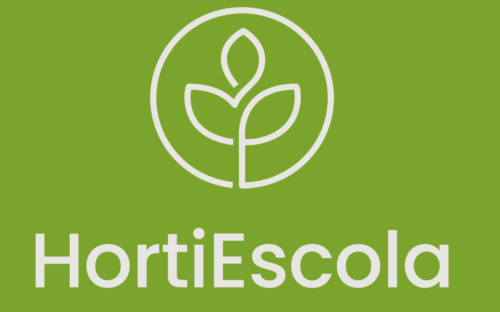
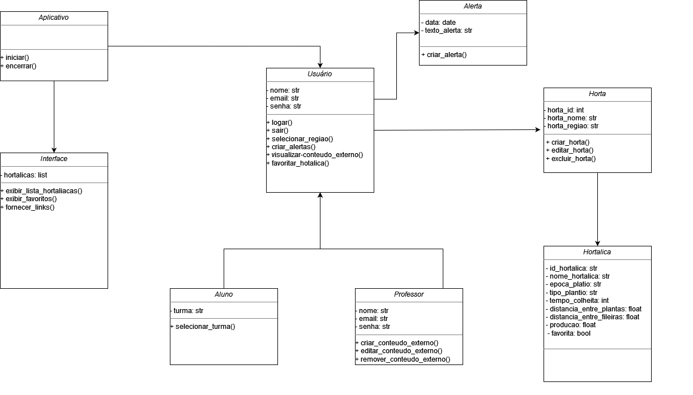

<h1 align="center">🌱</h1>

<h2 align="center">Aplicativo para Gestão de Calendário de Plantio em Hortas Escolares!</h2>

<h3>
Repositório para realização e controle do desenvolvimento do aplicativo HortiEscola.<h3>

<h2>Descrição</h2>
Aplicativo para Gestão de Calendário de Plantio em Hortas Escolares

<h3>Objetivos</h3>
• Desenvolver um aplicativo para gestão de calendário de plantio em hortas escolares.

• Promover a educação ambiental sobre horticultura e agricultura sustentável.
• Contribuir para a melhoria da segurança alimentar e nutricional dos alunos e da comunidade escolar.

<h3>Requisitos funcionais</h3>
•	Exibir uma lista de todas as hortaliças cadastradas.

•	Ao selecionar uma hortaliça, o sistema deve exibir as seguintes informações: 

    • Nome da hortaliça
    • Informações sobre a planta
    • Quais meses do ano realizar o plantio
    • Quando realizar a colheita
    • Quantidade de produção por m²
    • Distância entre mudas no plantio
    • Forma de plantio mais adequada

•	O usuário deve poder adicionar novas hortaliças ao sistema.
•	Para cada hortaliça, o usuário deve fornecer as seguintes informações: 

    • Nome da hortaliça
    • Informações sobre a planta
    • Quais meses do ano realizar o plantio
    • Quando realizar a colheita
    • Quantidade de produção por m²
    • Distância entre mudas no plantio
    • Forma de plantio mais adequada
•	O usuário deve poder selecionar a região do país em que está localizada a horta.
•	O usuário deve poder criar uma lista de hortaliças favoritas.
•	O sistema deve fornecer links para conteúdos externos com mais informações sobre hortaliças.
•	O sistema deve permitir que o usuário crie alertas no Google Agenda para lembrar sobre o plantio e a colheita de hortaliças.

<h3>Requisitos não funcionais </h3>
<h5>Desempenho:</h5>
•	O sistema deve ser capaz de carregar a lista de hortaliças em menos de 5 segundos.

•	O tempo de resposta para exibir as informações detalhadas de uma hortaliça selecionada deve ser inferior a 2 segundos.
•	O sistema deve funcionar de forma estável e sem travamentos, mesmo com vários usuários acessando simultaneamente.

<h5>Usabilidade:</h5>
• A interface do usuário deve ser simples e intuitiva para crianças de 10 a 15 anos.

• A fonte e o tamanho do texto devem ser fáceis de ler.
• As imagens das hortaliças devem ser de alta qualidade.
• Os botões e outras interfaces de interação devem ser grandes e fáceis de tocar.
• O sistema deve oferecer suporte a narração de voz para usuários com deficiência visual.
• O sistema deve ser compatível com os principais leitores de tela.

<h5>Manutenção:</h5>
•	O código do sistema deve ser bem documentado e fácil de entender.

•	O sistema deve ser modular para facilitar a adição de novas funcionalidades.
•	O sistema deve ser atualizado regularmente para corrigir bugs e melhorar a performance.
•	O sistema deve ser fácil de implantar em novos dispositivos.

<h2>UML</h2>

<h2 id="Agradecimentos">Agradecimentos</h2>

...

<h2 id="Autor">Autor</h2>

